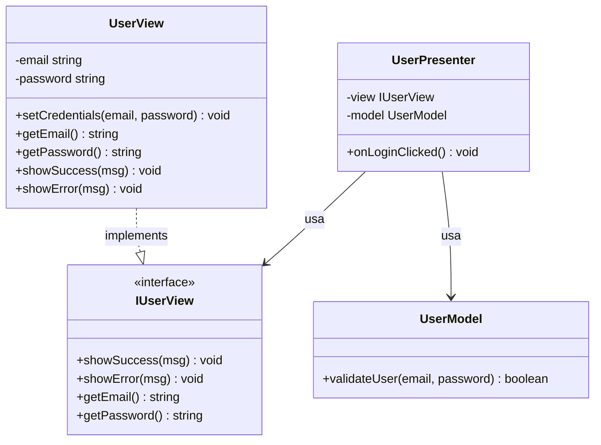

```mermaid
classDiagram
    class IUserView {
        <<interface>>
        +showSuccess(msg) void
        +showError(msg) void
        +getEmail() string
        +getPassword() string
    }

    class UserView {
        -email string
        -password string
        +setCredentials(email, password) void
        +getEmail() string
        +getPassword() string
        +showSuccess(msg) void
        +showError(msg) void
    }

    class UserModel {
        +validateUser(email, password) boolean
    }

    class UserPresenter {
        -view IUserView
        -model UserModel
        +onLoginClicked() void
    }

    UserView ..|> IUserView : implements
    UserPresenter --> IUserView : usa
    UserPresenter --> UserModel : usa
```